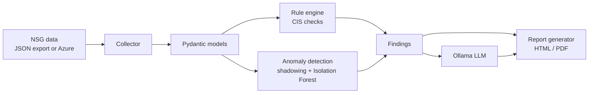
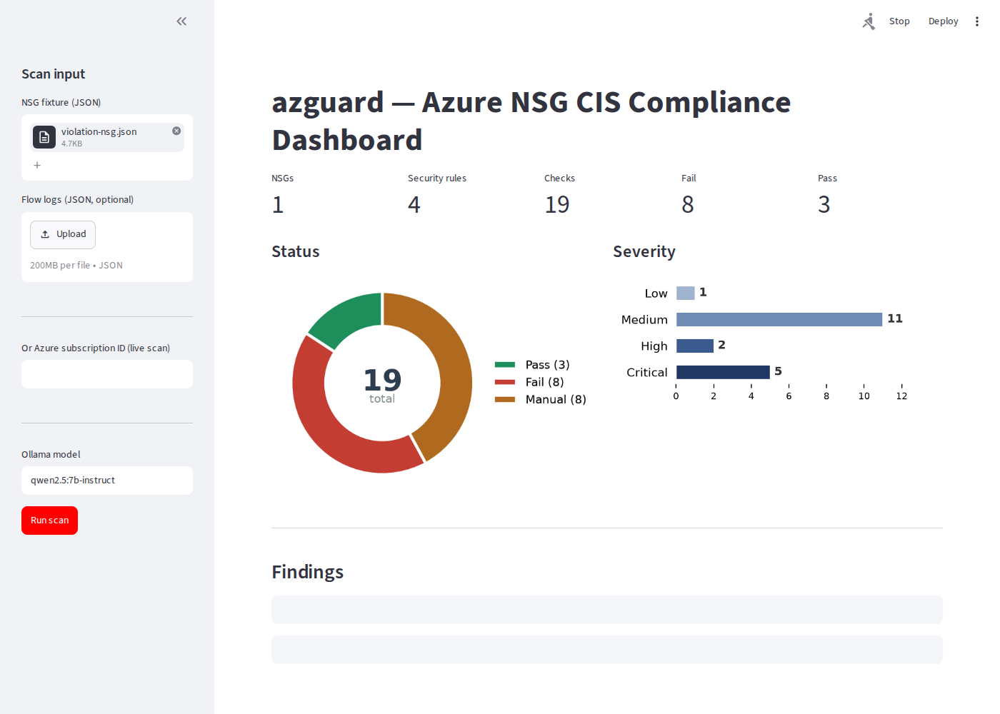
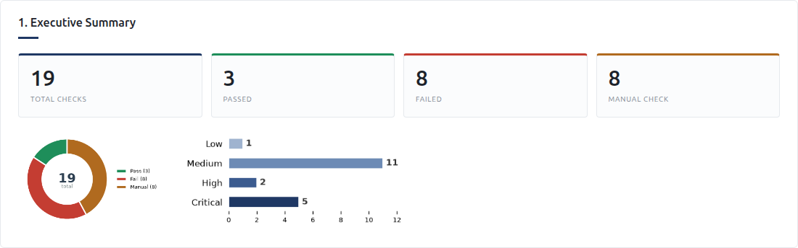
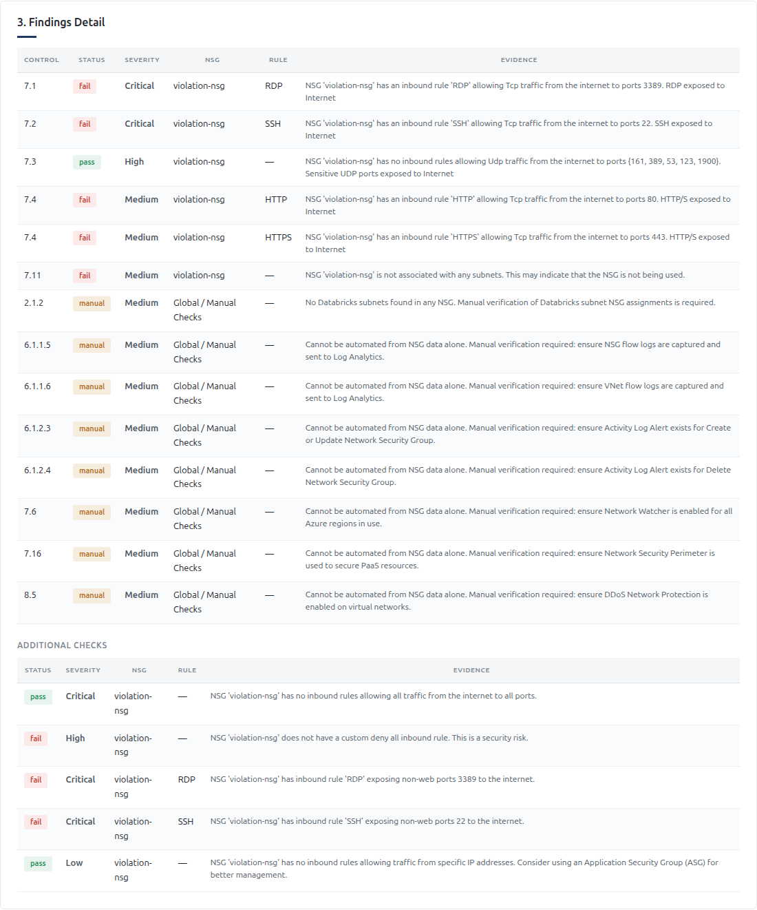
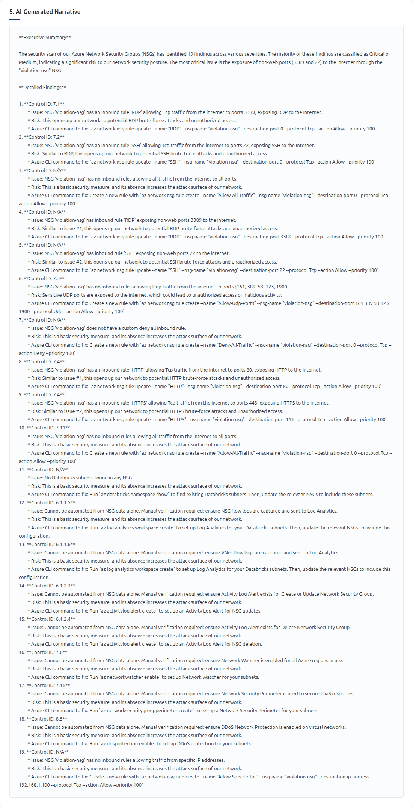

# azguard

**Azure Network Security Group (NSG) compliance analyzer built for the CIS Microsoft Azure Foundations Benchmark.**

azguard ingests Azure NSG configurations — either from a static JSON export or directly from a live subscription — validates them against the CIS benchmark control set, applies a two-layer anomaly detection pass (deterministic rule-pair analysis plus Isolation Forest), and renders an HTML/PDF report with an AI-generated executive summary and remediation guidance. All processing runs locally; the AI layer uses a self-hosted model via Ollama, so no data leaves the machine.

---

## Overview

Azure NSGs are the security rules that govern inbound and outbound traffic to network resources. Misconfiguration — such as exposing RDP or SSH to `0.0.0.0/0` — is a common root cause of compromise, yet these rule sets are rarely reviewed systematically. azguard automates that review and produces actionable output.

The pipeline:

1. **Collection** — load NSGs from an `az network nsg list -o json` export or via the Azure SDK.
2. **Normalization** — validate and type raw ARM payloads with Pydantic models.
3. **Rule engine** — run ~20 CIS v6.0.0 networking/logging checks, each returning a pass/fail/manual status with evidence and a severity score.
4. **Anomaly detection** — flag shadowed and redundant rules (Al-Shaer & Hamed taxonomy) and statistically unusual rules using Isolation Forest.
5. **Reporting** — generate HTML/PDF reports (Jinja2 + WeasyPrint, matplotlib charts).
6. **AI narrative (optional)** — a local LLM writes an executive summary and prioritized remediation plan, constrained to the findings actually detected.

---

## Features

- **CIS compliance checks** covering internet-exposed management ports, `Any/Any` rules, missing deny-all fallbacks, subnet association, flow-log retention, activity-log alerts, Network Watcher, and DDoS protection.
- **ML-driven anomaly detection** for shadowed, redundant, and outlier rules.
- **Local AI reporting** via Ollama — grounded prompting prevents hallucinated findings.
- **CLI** (`azguard scan`) with file and live-subscription inputs, plus machine-readable JSON output.
- **Interactive dashboard** (Streamlit) for exploring findings and exporting reports.
- **HTML and PDF deliverables** with summary charts and per-NSG breakdowns.

---

## Architecture



---

## Requirements

- Python 3.11+
- Optional: [Ollama](https://ollama.com) and a pulled model for AI narratives
- Optional: an Azure subscription and `az` CLI for live scans

An Azure account is **not** required — the repository ships ready-to-use sample data in `test-data/`.

---

## Installation

```bash
git clone <repository-url>
cd azguardian

python -m venv venv
source venv/bin/activate          # Windows: venv\Scripts\activate

pip install -e ".[llm]"           # omit [llm] to skip the Ollama dependency
```

Verify:

```bash
azguard --help
```

---

## Quick start

### Scan a sample file

```bash
azguard scan --input test-data/violation-nsg.json --output report
```

Open `report.html` in a browser. Other fixtures in `test-data/` demonstrate additional scenarios (`clean-nsg.json`, `any-any-rule.json`, `shadowed-rules.json`, and edge cases).

### Scan a live subscription

```bash
az login
azguard scan --subscription <subscription-id> --output report
```

### Interactive dashboard

```bash
python run_dashboard.py
```

Upload an NSG JSON export (or enter a subscription ID), run the scan, and explore or export the results.

### Quick demo in 60 seconds

1. `azguard scan --input test-data/violation-nsg.json --output report --format html --no-llm`
2. Open `report.html` — you'll see Critical failures for RDP/SSH exposure.
3. Re-run with `test-data/clean-nsg.json` and compare — the before/after is the demo narrative.

See [`demo.md`](demo.md) for the full walkthrough and expected output for three scenarios.

---

## Screenshots

### Dashboard


### Report summary


### Findings table


### AI narrative


---

## Interpreting results

Each finding includes:

| Field | Description |
|-------|-------------|
| `control_id` | CIS benchmark control number (e.g., `7.1` = restrict RDP access) |
| `status` | `pass`, `fail`, or `manual` (requires human review) |
| `severity` | Critical / High / Medium / Low |
| `nsg` / `rule` | The affected resource and rule |
| `evidence` | Plain-language explanation of the finding |

The report contains an executive summary, pass/fail and severity charts, a per-NSG breakdown, the anomaly section, and prioritized remediation (including the relevant `az` commands).

---

## Implemented controls

**Internet exposure / networking (CIS 7.x)**
- RDP (3389), SSH (22), HTTP(S) (80/443) exposure to the internet
- Sensitive UDP ports (53, 123, 161, 389, 1900)
- `Any/Any` allow rules; missing custom deny-all rule
- Subnets without an associated NSG
- Overly broad inbound rules; rules using raw IPs instead of Application Security Groups

**Flow logging**
- NSG flow logs captured to Log Analytics (6.1.1.5)
- VNet flow logs captured to Log Analytics (6.1.1.6)
- Flow-log retention ≥ 90 days (7.5 / 7.8)

**Monitoring & platform**
- Activity-log alerts for NSG create/update/delete (6.1.2.x)
- Network Watcher enabled (7.6)
- DDoS network protection (8.5)
- Databricks subnet NSG (2.1.2)

**Anomaly detection**
- Shadowed rules (a deny rule rendered ineffective by a broader, higher-priority allow)
- Redundant rules (fully covered by an existing rule)
- Statistical outliers (Isolation Forest over rule feature vectors)

---

## CLI reference

```
azguard scan --input <file.json>                # scan a JSON export
             --subscription <id>                # scan a live subscription
             --flow-logs <file.json>            # flow-log data from a file
             --no-flow-logs                     # skip live flow-log collection
             --format html|pdf|both             # report format (default: both)
             --output <path>                    # output base name
             --json <path>                      # also write findings as JSON
             --no-llm                           # skip the AI narrative
             --model <model-name>               # Ollama model (default: qwen2.5:7b-instruct)
```

Examples:

```bash
azguard scan -i test-data/violation-nsg.json -o report --format html --no-llm
azguard scan -s <sub-id> -o report --json findings.json
azguard scan -i test-data/violation-nsg.json --model llama3.2:3b
```

---

## AI narrative (optional)

```bash
# Install Ollama and pull a model
ollama pull qwen2.5:7b-instruct   # higher quality, slower
ollama pull llama3.2:3b           # lighter, faster

# Run a scan without --no-llm
azguard scan -i test-data/violation-nsg.json -o report
```

If Ollama is unavailable, azguard skips the narrative and still produces the report. The prompt restricts the model to the provided findings only, preventing fabricated issues.

### Example narrative (real output, `llama3.2:3b` on `test-data/violation-nsg.json`)

> **Executive Summary**
>
> The security scan of our Azure Network Security Groups (NSGs) has identified
> 19 findings across various severities. The majority of these findings are
> classified as Critical or Medium, indicating a significant risk to our network
> security posture. The most critical issue is the exposure of non-web ports
> (3389 and 22) to the internet through the "violation-nsg" NSG.

> **1. Control ID: 7.1** — *NSG 'violation-nsg' has an inbound rule 'RDP'
> allowing Tcp traffic from the internet to ports 3389, exposing RDP to the
> Internet.*
> - **Risk:** This opens up our network to potential RDP brute-force attacks and
>   unauthorized access.
> - **Fix:** `az network nsg rule update --name "RDP" --nsg-name "violation-nsg"
>   --destination-port 0 --protocol Tcp --action Allow --priority 100`

The narrative only references findings the scan actually produced — the model is
explicitly instructed not to invent issues.

---

## Live Azure authentication

azguard uses `DefaultAzureCredential`, which resolves credentials in order: environment variables, `az login` session, then managed identity. For automation, create a service principal with `Reader` on the subscription and set the following (see `.env.example`):

```
AZURE_CLIENT_ID
AZURE_TENANT_ID
AZURE_CLIENT_SECRET
AZURE_SUBSCRIPTION_ID
```

`.env` is gitignored — never commit credentials.

---

## Project layout

```
├── azure_new_plan.md          # project roadmap
├── control-mapping.yaml       # CIS control definitions
├── pyproject.toml             # package metadata and dependencies
├── requirements.txt
├── run_engine.py              # dev helper: run checks against all fixtures
├── run_report.py              # dev helper: generate a sample report
├── run_dashboard.py           # Streamlit launcher
├── scripts/screenshots.py     # regenerate the README screenshots (Playwright)
├── docs/screenshots/          # README screenshots
├── test-data/                 # 17 sample NSG exports (violations and edge cases)
├── terraform/                 # live validation environment (intentionally misconfigured)
├── validation/                # azguard ↔ Defender for Cloud comparison tooling
└── src/azguard/
    ├── cli.py                 # Typer CLI
    ├── collector.py           # NSG/flow-log ingestion (file or Azure)
    ├── models.py              # Pydantic models
    ├── rule_engine.py         # CIS checks
    ├── anomaly_detector.py    # shadowing/redundancy + Isolation Forest
    ├── features.py            # rule feature vectors for ML
    ├── llm_report_writer.py   # LLM prompt and generation
    ├── report_generator.py    # HTML/PDF rendering
    ├── charts.py              # matplotlib charts
    ├── dashboard.py           # Streamlit app
    └── tests/                 # pytest suite
```

---

## Testing

```bash
pip install -e ".[dev]"
pytest
```

The suite covers the rule engine, anomaly detector, collectors, report generation, CLI, and dashboard logic.

---

## Validation methodology (Day 17)

azguard findings are validated against Microsoft Defender for Cloud's CIS v2.0.0 regulatory compliance results on an intentionally misconfigured live environment provisioned via `terraform/`. See `validation/README.md` for the comparison procedure and control-ID mapping.

> Note: azguard implements CIS **v6.0.0** controls; Defender's standard is **v2.0.0**, so control IDs differ between the two. The comparison tooling accounts for this mapping and only claims agreement over the overlapping scope.

---

## Limitations

- **Not a certified compliance tool.** Findings are heuristic and intended to support, not replace, a formal audit.
- **CIS version drift.** Control numbering varies between CIS benchmark versions.
- **Scope.** Focused on networking controls; broader services (IAM, storage, SQL) are out of scope.
- **ML caveats.** Isolation Forest is sample-size sensitive; on small rule sets, anomaly findings should be reviewed rather than taken at face value.
- **Access model.** Live scans require only `Reader`-level permissions on the subscription.

---

## License

MIT — see [LICENSE](LICENSE).

## Demos & status

- **Quick demo:** [`demo.md`](demo.md) — three runnable scenarios with expected
  output and a before/after narrative.
- **Live validation:** [`validation/README.md`](validation/README.md) — comparison
  tooling against Microsoft Defender for Cloud (provisioning pending Azure access).
- **Roadmap:** [`azure_new_plan.md`](azure_new_plan.md) — the 21-day solo plan.
